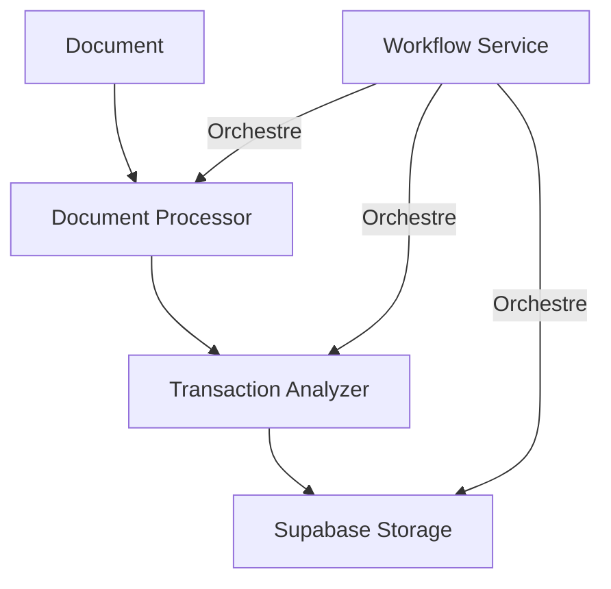

# Services Orchestrateur

Ce module contient l'implémentation des services principaux de l'orchestrateur de workflows de traitement des documents et transactions.

## 🏗 Architecture

```
services/
├── document_client.py     # Client pour le service Document Processor
├── transaction_client.py  # Client pour le service Transaction Analyzer
├── supabase_client.py    # Client pour le stockage Supabase
├── workflow_service.py   # Service principal d'orchestration
└── README.md            # Cette documentation
```

## 🔄 Flux de données



## 📦 Services

### WorkflowService
Service principal qui orchestre le flux de traitement :
- Création et gestion des workflows
- Coordination des appels aux services
- Gestion des états et erreurs

```python
workflow_service = WorkflowService(config)
workflow = await workflow_service.start_workflow(workflow_data)
```

### DocumentProcessorClient
Client pour l'interaction avec le service de traitement de documents :
- Envoi de documents pour traitement
- Surveillance du statut de traitement
- Gestion des retries et erreurs

```python
doc_client = DocumentProcessorClient(config)
result = await doc_client.process_document(document_path)
```

### TransactionAnalyzerClient
Client pour l'analyse des transactions :
- Envoi de transactions pour analyse
- Support du traitement par lots
- Retry automatique en cas d'erreur

```python
tx_client = TransactionAnalyzerClient(config)
result = await tx_client.analyze_transactions(user_id, transactions)
```

### SupabaseClient
Client pour la persistence des données :
- Stockage des workflows
- Stockage des transactions
- Gestion des conversions de données

```python
supabase = SupabaseClient(config)
await supabase.store_transactions(user_id, transactions)
```

## 🔐 Gestion des erreurs

Chaque service implémente :
- Retry automatique avec backoff exponentiel
- Logging détaillé des erreurs
- Nettoyage et reprise sur erreur

Exemple de gestion d'erreur :
```python
@retry(
    stop=stop_after_attempt(3),
    wait=wait_exponential(multiplier=1, min=4, max=10)
)
async def process_document(self, path: str):
    try:
        return await self._process(path)
    except Exception as e:
        log.error(f"Error processing document: {e}")
        raise
```

## 🔄 États des Workflows

1. **PENDING** : Workflow créé
2. **DOCUMENT_PROCESSING** : Document en cours de traitement
3. **TRANSACTION_ANALYSIS** : Transactions en cours d'analyse
4. **STORAGE** : Stockage des résultats
5. **COMPLETED** : Workflow terminé avec succès
6. **FAILED** : Workflow échoué

## 📊 Monitoring

Chaque service fournit :
- Logs détaillés des opérations
- Métriques de performance
- État de santé

## 🔧 Configuration

La configuration des services se fait via :
- Fichiers de configuration YAML
- Variables d'environnement
- Options par défaut

## 🧪 Tests

Pour tester les services :
```bash
# Tests unitaires
pytest tests/services/

# Tests d'intégration
pytest tests/integration/
```

## 📝 À faire

- [ ] Ajouter metrics Prometheus
- [ ] Implémenter circuit breaker
- [ ] Ajouter caching Redis
- [ ] Améliorer monitoring

## 🤝 Contribution

1. Les nouveaux services doivent :
   - Implémenter la gestion d'erreurs
   - Supporter les retries
   - Fournir des logs détaillés
   - Être testables

2. Guidelines :
   - Utiliser async/await
   - Documenter les interfaces
   - Suivre les patterns existants
   - Ajouter des tests